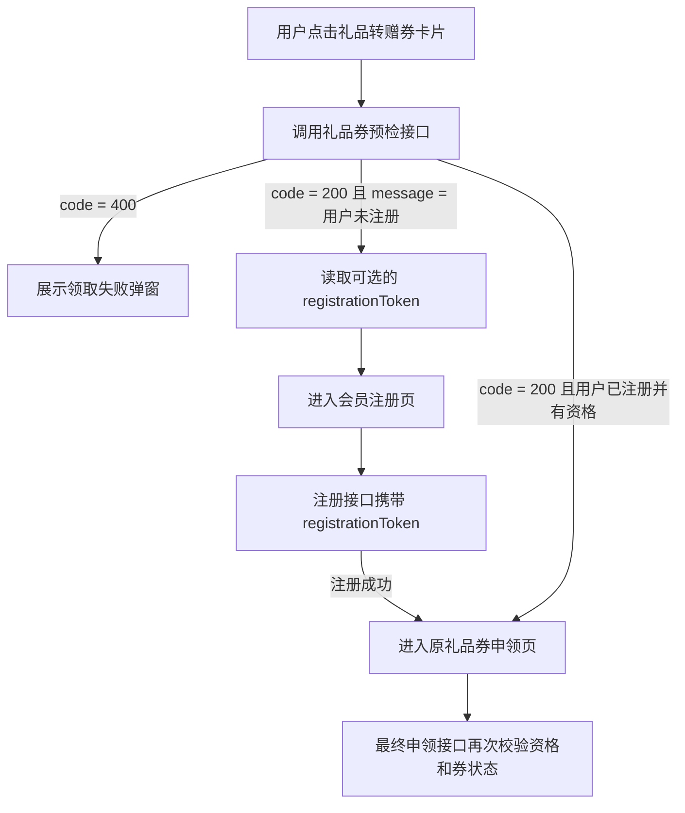

# 礼品转赠券“仅限首次注册会员领取”前端开发说明

## 1. 文档目的

本文用于小程序端和后台管理端开发、联调及验收。

本次后端已增加“礼品转赠券是否仅限首次注册会员领取”的全局控制能力。前端需要完成：

1. 后台管理端增加全局开关。
2. 小程序在礼品转赠券预检后，将后端返回的 `registrationToken` 透传到会员注册接口。
3. 已注册会员不符合领取条件时，在礼品转赠券页面展示后端返回的限制文案。

本文只描述前端改动，不要求前端实现或判断新老会员资格。领取资格以服务端校验结果为准。

## 2. 业务规则

### 2.1 开关含义

配置字段：`newMemberOnly`

| 配置值 | 业务含义 |
| --- | --- |
| `true` | 开启限制。已注册会员不能领取礼品转赠券；通过某张礼品转赠券完成首次注册的会员，只能继续领取与该次注册绑定的那张券。 |
| `false` | 关闭限制。已注册会员可以按原有流程领取礼品转赠券。 |

该配置是所有礼品转赠券共用的全局开关，不属于某一张券，因此后台更新配置时不传 `couponId`、`sampleId` 或 `uniqueCode`。

### 2.2 券与首次注册资格的绑定

以礼品转赠券 A 和 B 为例：

1. 未注册用户打开券 A 的小程序卡片。
2. 预检接口为“当前用户 + 券 A”生成 `registrationToken`。
3. 小程序进入注册页，并在提交注册时携带该 `registrationToken`。
4. 注册成功后，服务端将该会员的首次注册资格绑定到券 A。
5. 用户可以立即或稍后返回领取券 A，前提是券仍有效且未被他人领取。
6. 用户已经成为注册会员，但没有券 B 的绑定资格，因此在开关开启时不能领取券 B。

`registrationToken` 是服务端生成的临时凭证，服务端通过它查找“当前用户 + 当前礼品转赠券”的绑定记录。前端不解析 token，只负责原样透传。注册接口只需要增加这一个参数，不需要同时增加 `couponId`、`sampleId` 或 `uniqueCode`。



## 3. 小程序端改动

小程序仓库：`darphin-Wechat-Mini-Program`

本次只修改 `couponType == '2'` 的礼品转赠券链路。普通转赠券和其他注册入口必须保持原有行为。

### 3.1 礼品转赠券入口页

文件：

`miniprogram/package_coupon/pages/transferCoupon/transferCoupon.ts`

当前礼品券预检接口为：

```http
POST /api/darphin/v1/couponTransferRecord/checkTransferSampleCoupon
Content-Type: application/json
```

请求参数保持不变：

```json
{
  "uniqueCode": "礼品转赠券码",
  "applyAfterFlag": 0
}
```

开关开启且当前用户未注册时，成功响应示例：

```json
{
  "code": 200,
  "message": "用户未注册",
  "data": {
    "sampleId": 21,
    "couponId": 11,
    "uniqueCode": "礼品转赠券码",
    "registrationToken": "32位大写十六进制字符串"
  }
}
```

开关关闭时，未注册用户仍可能收到 `message = 用户未注册`，但 `data.registrationToken` 可以不存在。

#### 必须修改的逻辑

1. 当前代码使用 `res.data == '用户未注册'` 判断注册状态，这是错误的字段。
2. 应改为判断 `res.message === '用户未注册'`。
3. 当用户需要注册时，将 `res.data.registrationToken` 作为页面参数传给 `receiveCard` 注册页。
4. `registrationToken` 是可选值。开关关闭时，未注册用户仍会进入原注册流程，但后端可以不返回 token。
5. 已注册用户被限制时，接口返回业务 `code = 400`，继续使用页面现有领取失败弹窗展示 `res.message`。

建议实现方式（示意代码，按现有代码风格合并）：

```ts
const needRegister = app.globalData.type == 1 || res.message === '用户未注册'

if (needRegister) {
    const registrationToken = res.data && res.data.registrationToken
        ? res.data.registrationToken
        : ''

    let url = "../../../package_userInfo/pages/receiveCard/receiveCard" +
        "?transferCoupon=transferCoupon" +
        "&uniqueCode=" + uniqueCode +
        "&sampleId=" + res.data.sampleId +
        "&couponId=" + res.data.couponId +
        "&couponType=" + that.data.couponType

    if (registrationToken) {
        url += "&registrationToken=" + encodeURIComponent(registrationToken)
    }

    wx.redirectTo({ url })
}
```

注意：不要只依赖 `app.globalData.type` 判断是否需要注册，后端响应中的 `message` 也必须正确判断。

#### 已注册用户限制弹窗

开关开启且已注册用户不具备当前券资格时，预检接口返回：

```json
{
  "code": 400,
  "message": "感谢关注巴黎朵梵\n本次活动仅限朵梵首次注册会员参与\n欢迎前往朵梵官方会员小程序\n添加门店企业微信了解详情",
  "data": {}
}
```

页面应使用现有“领取失败”弹窗展示 `message`，按 `\n` 显示为四个语义完整的短行：

```text
感谢关注巴黎朵梵
本次活动仅限朵梵首次注册会员参与
欢迎前往朵梵官方会员小程序
添加门店企业微信了解详情
```

文案由后端返回，前端不要通过匹配具体文案来判断业务，也不要另行硬编码一份文案。当前页面已有 `code == 400` 的换行和弹窗处理，可直接复用。

### 3.2 会员注册页

文件：

`miniprogram/package_userInfo/pages/receiveCard/receiveCard.ts`

#### 必须修改的逻辑

1. 页面 `data` 增加 `registrationToken`，默认值为空字符串。
2. `onLoad(options)` 从 `options.registrationToken` 读取并保存该值。
3. 调用会员注册接口时，仅在 token 非空时增加 `registrationToken` 参数。
4. 注册成功后的页面跳转保持原样，不需要继续将 token 传给 `applyInfo`。
5. 删除或脱敏当前 `console.info('🚀  options:', options)`。该日志会输出完整 token。
6. 不要将 token 保存到 `globalData`、Storage、埋点、错误上报或其他持久化位置。

页面状态示意：

```ts
data: {
    // 原有字段省略
    registrationToken: ''
}
```

接收参数示意：

```ts
this.setData({
    options,
    registrationToken: options.registrationToken || ''
})
```

注册接口：

```http
POST /api/darphin/v1/miniMember/memberSubmit
Content-Type: application/json
```

在现有注册参数基础上增加一个可选参数：

```json
{
  "memberName": "会员姓名",
  "phone": "手机号",
  "birthdayYear": "1990",
  "birthdayMonth": "01",
  "birthdayDay": "01",
  "province": "上海市",
  "city": "上海市",
  "userid": "原有参数",
  "source": "原有参数",
  "registrationToken": "32位大写十六进制字符串"
}
```

建议先组装原有请求对象，再按条件增加参数：

```ts
const params: any = {
    // 原有注册参数保持不变
}

if (that.data.registrationToken) {
    params.registrationToken = that.data.registrationToken
}

receiveCardApi._post('/api/darphin/v1/miniMember/memberSubmit', params)
```

普通注册入口没有 `registrationToken`，不得因此阻断注册。空值可以不传；推荐不传，避免影响其他注册场景。

如果 token 非法、被篡改、已使用或已失效，注册接口会返回业务 `code = 400`。典型响应如下：

```json
{
  "code": 400,
  "message": "注册凭证无效或已失效，请重新进入礼品转赠券页面",
  "data": {}
}
```

具体 `message` 以服务端实际返回为准，例如同一会员重复提交注册时也可能返回“该用户已注册过会员”。注册页应沿用现有失败提示逻辑展示 `res.message`，并恢复提交按钮状态，允许用户重新操作。

### 3.3 礼品申领页

文件：

`miniprogram/package_apply/pages/applyInfo/applyInfo.ts`

最终申领接口保持不变：

```http
POST /api/darphin/v1/couponTransferRecord/transferSampleApply
Content-Type: application/json
```

请求示例：

```json
{
  "sampleId": 21,
  "couponId": 11,
  "uniqueCode": "礼品转赠券码",
  "storeId": "门店ID",
  "storeName": "门店名称"
}
```

这里不增加 `registrationToken`。服务端会根据当前登录会员和 `uniqueCode` 再次校验：

- 是否为该券绑定的首次注册会员；
- 是否为原券主人；
- 券是否有效、过期或已被领取；
- `sampleId`、`couponId` 和券是否匹配。

当前页面已有 `code == 400` 的单按钮失败弹窗和换行处理，保持并回归验证即可。

### 3.4 TypeScript 编译产物

该小程序仓库同时维护 `.ts` 和编译后的 `.js` 文件。完成 TypeScript 修改后，需要运行项目现有编译命令，确保对应 JavaScript 文件同步更新：

```bash
npm run compile
```

至少检查以下编译产物与 TypeScript 修改一致：

- `miniprogram/package_coupon/pages/transferCoupon/transferCoupon.js`
- `miniprogram/package_userInfo/pages/receiveCard/receiveCard.js`

## 4. 后台管理端改动

### 4.1 页面位置与交互

建议在现有“礼品转赠券”或“派发与转赠记录”页面增加一个全局 Switch。

| 项目 | 要求 |
| --- | --- |
| 开关名称 | `仅限首次注册会员领取` |
| 开启说明 | 已注册会员无法领取礼品转赠券。 |
| 关闭说明 | 已注册会员可以领取礼品转赠券。 |
| 作用范围 | 所有礼品转赠券，全局生效。 |

后台管理端源码未包含在当前小程序仓库中，因此由管理端同事按照实际页面结构选择组件位置和文件。

### 4.2 查询配置

页面进入时调用：

```http
GET /api/module/v1/couponTransferRecord/config
```

成功响应：

```json
{
  "code": 200,
  "message": "操作成功",
  "data": {
    "newMemberOnly": false
  }
}
```

将 `data.newMemberOnly` 设置为 Switch 当前状态。加载完成前应禁用 Switch 或展示加载状态。

如果查询失败，不要直接把界面默认值当作服务端实际配置并允许提交；应提示错误并提供重试，避免误导运营人员。

### 4.3 更新配置

切换开关时调用：

```http
PUT /api/module/v1/couponTransferRecord/config
Content-Type: application/json
```

请求体：

```json
{
  "newMemberOnly": true
}
```

关闭时传：

```json
{
  "newMemberOnly": false
}
```

更新成功响应：

```json
{
  "code": 200,
  "message": "操作成功",
  "data": {}
}
```

交互要求：

1. 请求过程中禁用 Switch，避免连续切换产生并发请求。
2. 以响应体中的业务 `code` 判断是否成功，不只判断 HTTP 状态码。
3. 更新失败时恢复切换前的状态，并展示后端 `message`。
4. 更新成功后提示保存成功；必要时可重新调用 GET 确认最终状态。
5. 请求沿用管理端现有登录态和统一请求拦截器。
6. 不需要选择具体券，也不传任何券 ID。

当 `newMemberOnly` 为空或未传时，后端返回：

```json
{
  "code": 400,
  "message": "newMemberOnly不能为空",
  "data": {}
}
```

## 5. 接口联调总表

| 场景 | 方法与接口 | 前端关键处理 |
| --- | --- | --- |
| 管理端读取开关 | `GET /api/module/v1/couponTransferRecord/config` | 使用 `data.newMemberOnly` 初始化 Switch。 |
| 管理端保存开关 | `PUT /api/module/v1/couponTransferRecord/config` | 只传布尔值 `newMemberOnly`，失败时回滚 Switch。 |
| 礼品券卡片预检 | `POST /api/darphin/v1/couponTransferRecord/checkTransferSampleCoupon` | 判断响应体 `code` 和 `message`；未注册时读取可选 token。 |
| 会员注册 | `POST /api/darphin/v1/miniMember/memberSubmit` | 仅礼品券注册链路携带 `registrationToken`。 |
| 礼品最终申领 | `POST /api/darphin/v1/couponTransferRecord/transferSampleApply` | 参数不变，不传 token；展示服务端最终校验错误。 |

所有接口都应以统一响应体中的 `code` 作为业务成功或失败依据：

- `code = 200`：业务成功；
- `code = 400`：业务校验失败，展示 `message`。

## 6. 前端开发任务清单

### 小程序端

- [ ] `transferCoupon.ts` 将未注册判断从 `res.data` 改为 `res.message`。
- [ ] 礼品券注册跳转增加可选的 `registrationToken` 页面参数。
- [ ] `receiveCard.ts` 增加、接收并临时保存 `registrationToken`。
- [ ] 注册请求仅在 token 非空时携带 `registrationToken`。
- [ ] 删除或脱敏会打印完整页面 `options` 的日志。
- [ ] 注册完成后不再向后续页面传 token，也不持久化 token。
- [ ] 已注册用户受限时复用现有领取失败弹窗展示后端四行文案。
- [ ] 最终申领接口保持原参数并回归失败弹窗。
- [ ] 运行 TypeScript 编译，提交同步生成的 `.js` 文件。

### 后台管理端

- [ ] 在礼品转赠券相关管理页面增加全局 Switch。
- [ ] 页面加载时通过 GET 初始化真实配置。
- [ ] 开关切换时通过 PUT 保存布尔值。
- [ ] 增加加载、保存中禁用、失败回滚和错误提示。
- [ ] 明确展示开启和关闭的业务含义。

## 7. 联调与验收用例

| 编号 | 前置条件与操作 | 预期结果 |
| --- | --- | --- |
| 1 | 开关关闭，已注册会员打开有效礼品转赠券并申领 | 按原流程可以领取。 |
| 2 | 开关开启，普通已注册会员点击礼品转赠券卡片 | 入口页按语义分四行展示限制文案，不能进入申领流程。 |
| 3 | 开关开启，未注册用户打开券 A | 预检返回“用户未注册”和 token，小程序进入注册页。 |
| 4 | 用户通过券 A 的 token 完成注册并立即申领 | 可以领取券 A。 |
| 5 | 用户通过券 A 注册但未立即申领，稍后重新打开仍未被领取的券 A | 仍可以领取券 A。 |
| 6 | 用户通过券 A 完成注册后，再打开券 B | 不能领取券 B，展示已注册会员限制文案。 |
| 7 | 普通注册入口不传 token | 注册流程不受影响；开关开启时，该会员没有任何特定礼品券的专属领取资格。 |
| 8 | 使用非法、篡改、已使用或失效 token 提交注册 | 注册失败，不能获得礼品券资格，并展示后端实际返回的错误信息。 |
| 9 | 原券主人打开自己分享的礼品转赠券 | 仍按原规则不能领取自己的券。 |
| 10 | 券已过期、已失效或已被其他用户领取 | 仍展示原有对应失败提示，不被新会员文案覆盖。 |
| 11 | 在申领页篡改 `sampleId` 或 `couponId` | 最终申领失败，不能绕过服务端校验。 |
| 12 | 管理端连续快速点击开关 | 保存期间 Switch 被禁用，只产生一次有效更新，界面最终状态与 GET 结果一致。 |
| 13 | 管理端 PUT 请求失败 | Switch 恢复旧值并展示后端错误信息。 |
| 14 | 检查控制台、Storage 和埋点数据 | 不存在明文 `registrationToken`。 |

## 8. 前端自测完成标准

1. 小程序 TypeScript 编译通过，修改对应的 `.js` 产物已同步。
2. 普通转赠券、普通注册、普通小样申领链路无回归。
3. 开关开启和关闭两种状态均完成真机或体验版联调。
4. 券 A 注册后可领取券 A、不可领取券 B 的核心规则验证通过。
5. 预检、注册和最终申领三个阶段的失败信息均能正确展示。
6. 前端不自行判定新老会员，不缓存、不记录 `registrationToken`。
